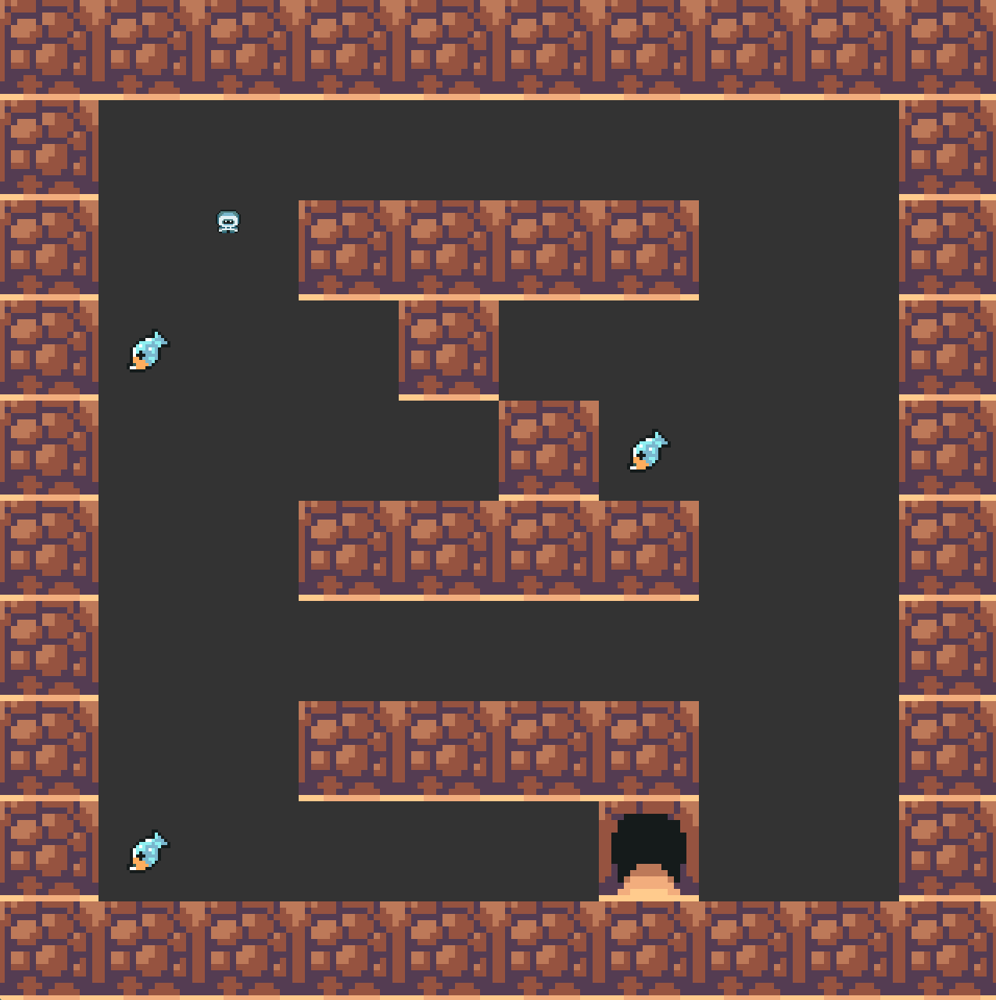

# so_long

## Overview

so_long is a simple 2D game built using the MiniLibX library. The objective of the game is to navigate through a map, collect all collectibles, and reach the exit while avoiding obstacles.

## Features

- Player Movement: Move the player character around the map.
- Collision Detection: Detect collisions with obstacles.
- Collectibles: Collect items scattered around the map.
- Exit: Reach the exit after collecting all items.
- Map Validation: Ensure the map is valid before starting the game.

## Getting Started

### Prerequisites

- MiniLibX: Ensure you have the MiniLibX library installed on your system.
- C Compiler: A C compiler like gcc.

### Installation

1. Clone the repository:
````
git clone https://github.com/eel-abed/so_long.git
cd so_long
````

2. Compile the project:
````
make
````
## Running the Game

To run the game, use the following command:
````
./so_long assets/map.ber
````

## Map File

The map file should have a .ber extension and follow these rules:

- 1 for walls/obstacles.
- C for collectibles.
- P for the player's starting position.
- E for the exit.

Example:
````
111111
1P0C01
100001
1C0E01
111111
````


## Code Structure

- hooks.c: Handles player movement and collision detection.
- map.c: Processes and validates the map.
- openfile.c: Handles file operations and checks file extensions.
- so_long.c: Main entry point of the game, initializes game assets and starts the game loop.

## Functions

### hooks.c
- check_collision: Checks if the player collides with any obstacles.
- update_position: Updates the player's position and counts movements.

### map.c
- process_char_instances: Processes map characters that have multiple instances.
- process_char_no_inst: Processes map characters that have a single instance.
- initialize: Initializes map reading variables.
- ini_map: Reads and processes the map file.
- read_map: Reads the map file and validates it.

### openfile.c
- ft_strrchr: Finds the last occurrence of a character in a string.
- ft_strcmp: Compares two strings.
- check_file_extension: Checks if the file has a .ber extension.
- openfile: Opens the map file and checks for errors.

### so_long.c
- ft_error: Prints an error message and exits the program.
- get_window_dimensions: Calculates the window dimensions based on the map size.
- init_game_assets: Initializes game assets.
- main: Main function to start the game.

## License

This project is licensed under the MIT License - see the LICENSE file for details.

## Acknowledgments

- Thanks to the 42 Network for the project inspiration.
- Special thanks to the MiniLibX library for providing the graphics framework.

